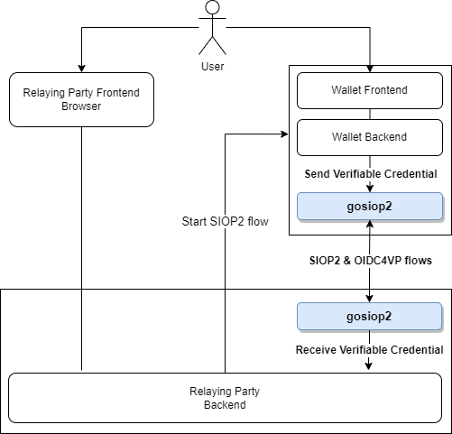
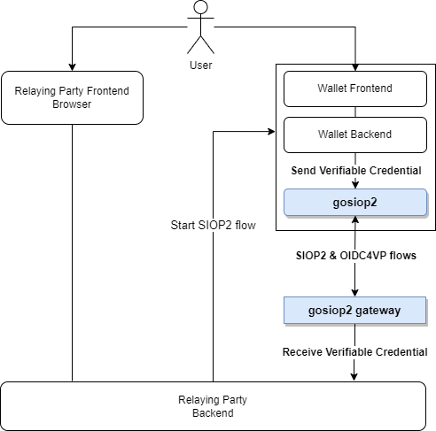

# SIOPv2 and OIDC for Verifiable Credentials in Go

This is a Go implementation of the OIDC extensions called OIDC4VP and SIOP2 which combined provide a proven, flexible and powerful mechanism to implement a SSI system with W3C Verifiable Credentals.

This repository includes:

- A library implementing a useful subset of the **SIOPv2** and **OIDC4VP** protocols to enable building W3C VC applications on top.
- A **Wallet** implemented as a server component and also (in the near future) as a PWA application able to store credentials in the user device.
- A simple **Relying Party** server component that the wallet can use to execute the flows.
- A simple **Vault** to manage private keys and perform digital signatures with different algorithms.

The library can be used in different contexts and configurations. The following figure describes one of the possible models and where the library fits in the overall solution.

In this scenario, the user is interacting with a web site (the one from the Relaying Party or RP in short) and indicates that it wants to perform an operation where the RP requires to receive a W3C Verifiable Credential from the user.

The RP then starts the SIOPv2 flow so the user can instruct her wallet to send one of her Verifiable Credentials to the RP. There are different ways to starts the flow, for example displayng a QR code that the user scans with her mobile phone.

In this specific use case, the wallet is implemented as a web app with the backend in the Go language so the backend can use the `gosiop2` library. Very soon there will be a JavaScript library so the wallet could be implemented as a PWA application with offline capabilities. Both models can coexist in a real-world implementation.
We also assume in this scenario that the RP backend is implemented in Go so it uses the same `gosiop2` library.

Of course, `gosiop2` is interoperable with any other compliant implementation of the SIOP2 and OIDC4VP standards, so you are free to use `gosiop2` in the RP, the wallet or both.

At the end of the flow, the RP backend receives a Verifiable Presentation with one or more Verifiable Credentials inside and can extract the data inside the verifiable Credential(s) to perform whatever business process it requires.

If your RP backend is not implemented in Go, the RP implementation in this repository can be used in *Gateway mode* where a secure and robust stand-alone process implements transparently the SIOP2 & OIDC4VP flows and passes to your backend the Verifiable Credential as a `bearer` token using a simple API call that your backend has to implement.

This is described conceptually in the following picture where the only difference is that the RP backend and `gosiop2 gateway` are separate processes.

More documentation is coming very soon ...