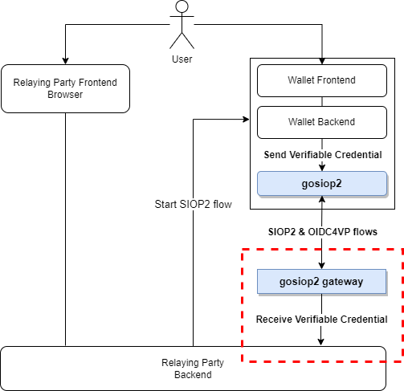

# Downstream API

At the end of the SIOP flow, the SIOP library/gateway invokes an API passing the Verifiable Credential with the data that can be used to implement a policy-based RBAC/ABAC access control. This is depicted in the following diagram in the dotted red box. The figure assumer that it is the RP the one implementing the API but it could be any other component implementing the enforcement of the access control policy.



In particular, the VC includes a `roles` claim in the `credentialSubject` object with the role data that can be used for access policy enforcement. The next figure shows an example of such a Verifiable Credential onece decoded into JSON format.

```json
{
  "@context": [
    "https://www.w3.org/2018/credentials/v1",
    "https://marketplace.i4trust.fiware.io/2022/credentials/employee/v1"
  ],
  "id": "https://pdc.i4trust.fiware.io/credentials/1872",
  "type": ["VerifiableCredential", "EmployeeCredential"],
  "issuer": {
    "id": "did:elsi:EU.EORI.NLPACKETDEL"
  },
  "issuanceDate": "2022-03-22T14:00:00Z",
  "validFrom": "2022-03-22T14:00:00Z",
  "expirationDate": "2023-03-22T14:00:00Z",
  "credentialSubject": {
    "id": "did:uuid:09b8a75c-6e8a-4992-ad47-362311595ec5",
    "verificationMethod": [
      {
        "id": "did:uuid:09b8a75c-6e8a-4992-ad47-362311595ec5#key1",
        "type": "JwsVerificationKey2020",
        "controller": "did:uuid:09b8a75c-6e8a-4992-ad47-362311595ec5",
        "publicKeyJwk": {
          "kid": "key1",
          "kty": "EC",
          "crv": "P-256",
          "x": "lJtvoA5_XptBvcfcrvtGCvXd9bLymmfBSSdNJf5mogo",
          "y": "fSc4gZX2R3QKKfHvS3m2vGSVSN8Xc04qsquyfEM55Z0"
        }
      }
    ],
    "roles": [
      {
        "target": "did:elsi:EU.EORI.NLMARKETPLA",
        "names": ["seller", "buyer"]
      }
    ],
    "name": "Perico Perez",
    "given_name": "Perico",
    "family_name": "Perez",
    "preferred_username": "Pepe",
    "email": "pepe.perez@gmaily.com"
  }
}
```