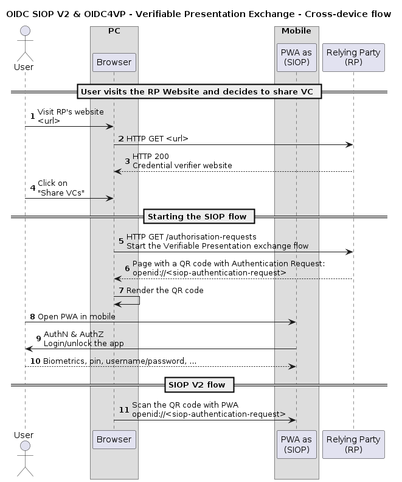
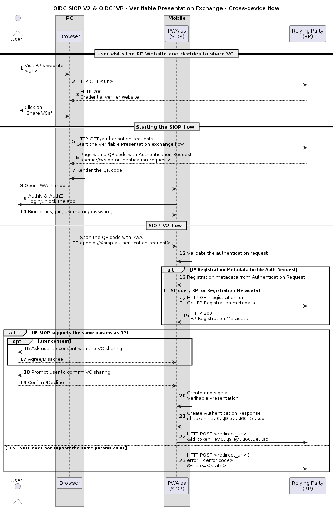

# Verifiable Presentation Exchange

This document contains the implementation details for the OIDC SIOP v2 (SIOPv2) protocol for issuers, verifiers and holders. It is a strict compatible superset of the one implemented in EBSI so applications developed on top are EBSI-compatible even if they work on other blockchain networks.

We reuse a lot of content from the EBSI documentation (read: copy & paste) instead of simply referring to it to make life easier for the reader. Anyway, the source of truth for the EBSI-related things is always in the EBSI documentation to which readers are encouraged to go in case of doubt.

In this section, we present the details of the Verifiable Presentation exchange flows using [OpenID Connect for Verifiable Presentations](https://openid.net/specs/openid-connect-4-verifiable-presentations-1_0-10.html) and [OpenID Connect Self-issued OpenID provider V2](https://openid.net/specs/openid-connect-self-issued-v2-1_0.html).

We focus in the cross-device flow because for most of the use cases we need to cover it is the most simple mechanism, robust, secure and flexible.
For example, the same-device flow assumes that the end-user has only one wallet that is used for all the credentials she uses, which is not a realistic assumption in our opinion.

## Cross-device VP exchange flow details

The cross-device exchange flow is used when the user has an SSI agent on a different device than the one she uses to visit a credential verifier's website. We will use interchangeably the term RP (Relying Party) for credential verifier. To make the detailed description clearer and given that there are different variations of the cross-device flow, we will make for the moment the following assumptions:

- The user has installed and set up her SSI agent. We assume without loss of generality that it is a PWA application in a mobile device, and that the user has configured the authentication that the PWA provides and that is completely independent from the credential verifier. We will use interchangeably the term `wallet` for SSI agent.

- The user is visiting the credential verifier's website with another device (PC, tablet, smart TV, ...).

- All interactions between the user devices and the RP servers are using HTTPS or similarly encrypted transport mechanisms (except the scanning of QR codes which happen obviously over-the-air).

- There is not a previous relationship between the user and the RP, in the sense that there is not a previous mechanism to stablish an authenticated session between the RP and the user. In other words, the user is not already a customer, employee, associate, etc, whith a previous onboarding process where the RP has verified the real identity of the user and assigned some credentials (e.g., user/password) that can be used to login in the RP website.

  Otherwise, the task of delivering one or more Verifiable Credentials from the user to the RP would be easier, by establishing the authenticated session and sending the VC as a file (e.g.) inside the session.

In this situation, we can assume that the RP does not have any previous information about the wallet (SIOP) that can be used to start the standard OIDC flow by using a well-known HTTPS endpoint of the OP (the wallet in this case). The mechanism to start the OIDC flows have to be inverted, by scanning a QR code using the wallet of the user.

### Starting the SIOP flow scanning a QR code

The initial steps to start the SIOP flow are described in the following diagram.
- **1-3** A user visits a credential verifier's website on her browser and the browser displays the website.

- **4** The user initiates the Verifiable Presentation exchange process by selecting "Share VC" (or similar action).

- **5** The browser sends an HTTPS GET request to the authorisation requests endpoint of the RP.

- **6-7** The RP server displays a page with a QR code including a SIOP Authentication Request, with instructions to the user to scan the QR to start the process.

- **8-10** The user opens the SSI agent that she wants (she may have several for several purposes) in her mobile, authenticating to it as required (note: this authentication process is just with the wallet and not with the RP). In this case she opens the PWA where she has stores her credentials relevant for this RP.

- **11** The user scans the QR with her mobile using the PWA. In this way the SSI agent receives the SIOP Authentication Request from the RP.

### Execution of the SIOP flow

Once the wallet receives the Authentication Request from the RP, it can process it and finally respond with a corresponding Authentication Response. Please note that for SIOP the Authentication Request travels inside a QR code and the Authentication Response will be transported in the **request** body of an HTTP POST.

The following diagram describes the complete flow until the RP receives the Verifiable Presentation which includes one or more Verifiable Credentials.

One of the possible uses that the RP can make from the Verifiable Credentials is an advanced RBAC/ABAC (role-based or attribute-based access control) using the claims inside the credentials and policy enforcement using a policy rules engine. This is out of scope of this chapter but it is addressed in another part of the documentation.

